##############################################################################
0. Getting Ready (Important)
##############################################################################

Before starting building the projects, you need to make some preparation first, which is so crucial that you must not skip.

Programming Software
********************************

Arduino Software (IDE) is used to write and upload the code for Arduino Board.

First, install Arduino Software (IDE): visit https://www.arduino.cc/en/software/

.. image:: ../_static/imgs/ArduinoIDE/Preface03.png
    :align: center
    :width: 99%
    :class: image-border

Select and download corresponding installer based on your operating system. If you are a Windows user, please select the "Windows" to download and install the driver correctly.

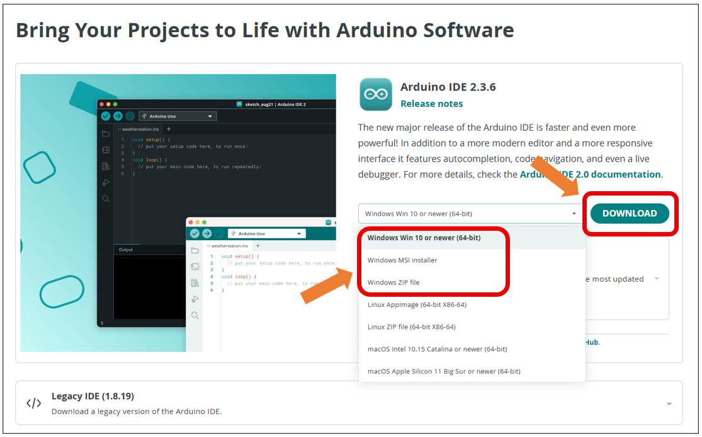

After the downloading completes, run the installer. For Windows users, there may pop up an installation dialog box of driver during the installation process. When it is popped up, please allow the installation.

After installation is completed, an shortcut will be generated in the desktop.

.. image:: ../_static/imgs/ArduinoIDE/Preface05.png
    :align: center

Run it. The interface of the software is as follows:

.. image:: ../_static/imgs/ArduinoIDE/Preface06.png
    :align: center

Programs written with Arduino IDE are called sketches. These sketches are written in a text editor and are saved with the file extension.ino. The editor has features for cutting/pasting and for searching/replacing text. The console displays text output by the Arduino IDE, including complete error messages and other information. The bottom right-hand corner of the window displays the configured board and serial port. The toolbar buttons allow you to verify and upload programs, open the serial monitor, and access the serial plotter.

.. table::
    :align: center
    :class: table-line
    :width: 80%
    
    +-------------+---------------------------------------------------------------------+
    | |Arduino07| | Verify                                                              |
    |             |                                                                     |
    |             | Checks your code for errors compiling it.                           |
    +-------------+---------------------------------------------------------------------+
    | |Arduino08| | Upload                                                              |
    |             |                                                                     |
    |             | Compiles your code and uploads it to the configured board.          |
    +-------------+---------------------------------------------------------------------+
    | |Arduino09| | Debug                                                               |
    |             |                                                                     |
    |             | Troubleshoot code errors and monitor program running status.        |
    +-------------+---------------------------------------------------------------------+
    | |Arduino10| | Serial Plotter                                                      |
    |             |                                                                     |
    |             | Real-time plotting of serial port data charts.                      |
    +-------------+---------------------------------------------------------------------+
    | |Arduino11| | Serial Monitor                                                      |
    |             |                                                                     |
    |             | Used for debugging and communication between devices and computers. |
    +-------------+---------------------------------------------------------------------+

.. |Arduino07| image:: ../_static/imgs/ArduinoIDE/Preface07.png
.. |Arduino08| image:: ../_static/imgs/ArduinoIDE/Preface08.png

.. |Arduino11| image:: ../_static/imgs/ArduinoIDE/Preface11.png

First Use
********************************

Open the example sketch "Blink".

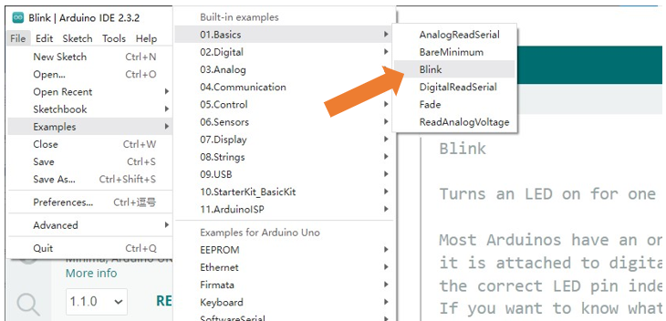

Select the board corresponding to the board you have in hands. Here we take Freenove Control Board (minina) as an example:

Select board "Arduino Uno R4 Minima". (Freenove control board is compatible with this board.)

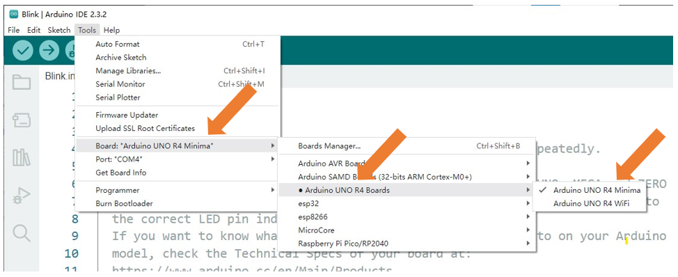

Select the port.

.. note::
    
    Your port may be different from the following figure.

On Windows: It may be **COM4** , **COM5** (Arduino Uno R4 Minima) or something like that.

On Mac: It may be **/dev/cu.usbserial-710** , **/dev/cu.usemodem7101** (Arduino Uno R4 Minima) or something like that.

On Linux: It may be **/dev/ttyUSB0** , **/dev/ttyACM0** or something like that.

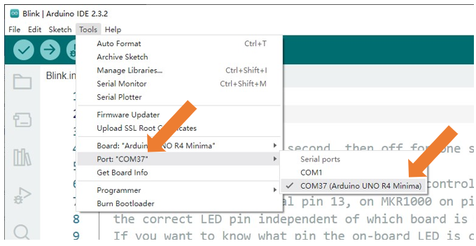

.. note::
    
    If there is more than one port and you cannot decide which one to choose, disconnect the USB cable and check the port. Then connect the USB cable and check the port again. The new one is the correct port.

:red:`Having problems?` Contact us for help! Send mail to: support@freenove.com

Click "Verify" button.

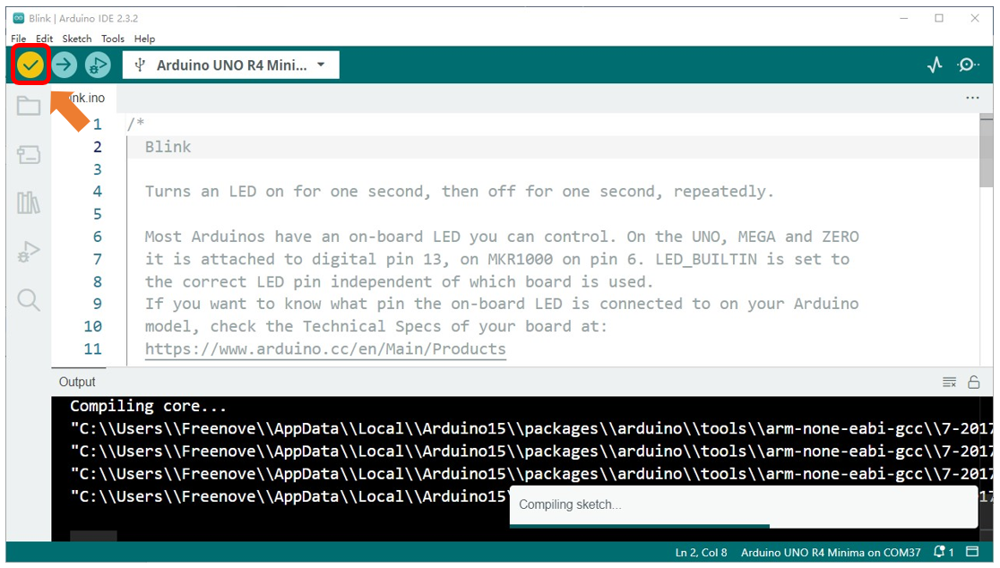

The following figure shows the code being compiled.

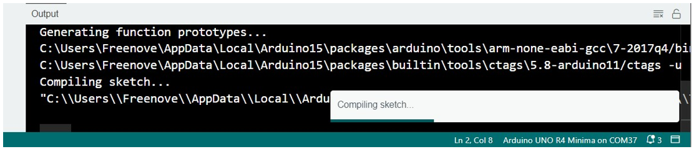

Wait a moment for the compiling to be completed. Figure below shows the code size and percentage of space occupation. If there is an error in the code, the compilation will fail and the details are shown here.

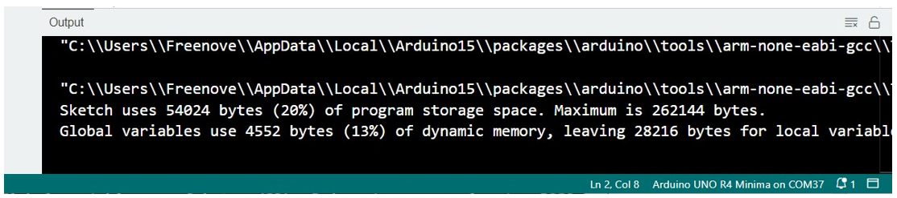

Click "Upload" button.

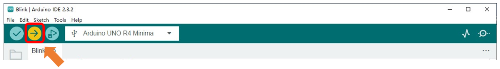

Figure below shows code are uploading. 

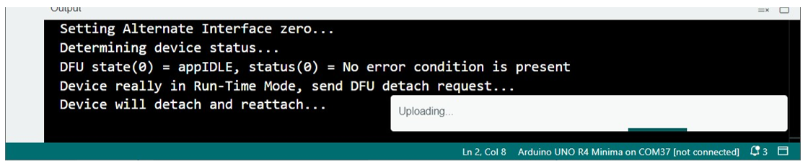

Wait a moment, and then the uploading is completed.

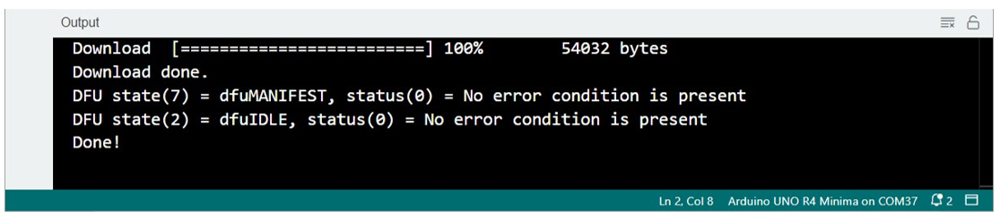

:red:`Having problems?` Contact us for help! Send mail to: support@freenove.com

After that, we will see the LED marked with "L" on the control board start blinking. It indicates that the code is running now!

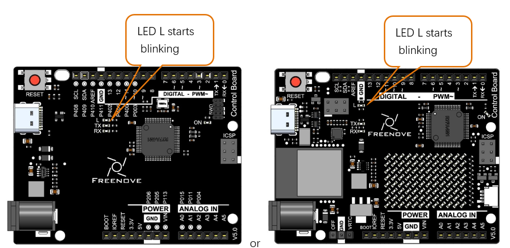

So far, we have completed the first use. I believe you have felt the joy of it. Next, we will carry out a series of projects, from easy to difficult, taking you to learn programming and the building of electronic circuit.

How to install the library
****************************************

There are two ways to include libraries on Arduino IDE.

The first way, open the Arduino IDE, click Tools -> Manager Libraries.

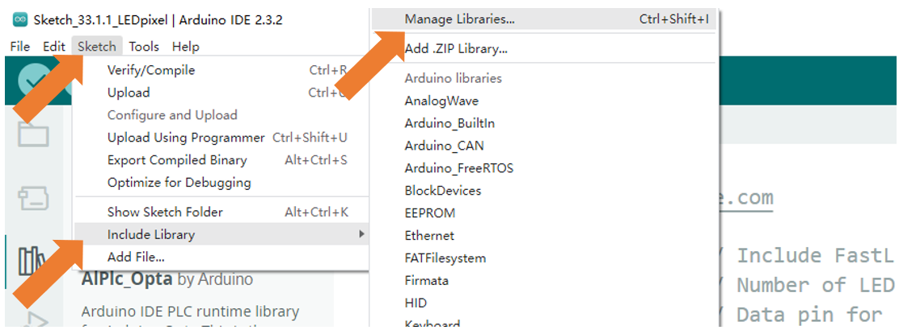

Here we take installing the "FastLED" library as an example. In the pop-up window, Library Manager, search for the name of the Library, "FastLED". Then click Install.

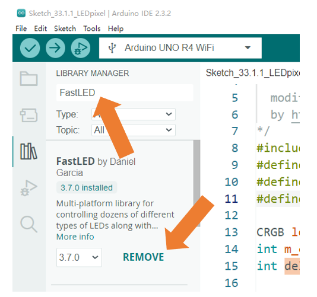

Or, you can click the Library icon on the left of Arduino IDE, and type in 'FastLED' on the search bar to install. 

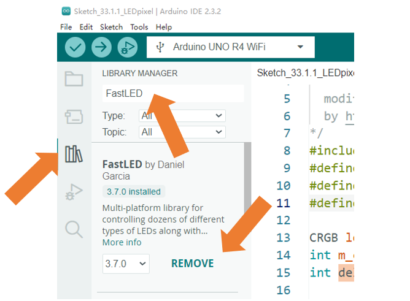

The second way, open Arduino IDE, click Sketch -> Include Library -> Add .ZIP Library. In the pop-up window, find the file named "./Libraries/FastLED.Zip" which locates in this directory, and click OPEN.

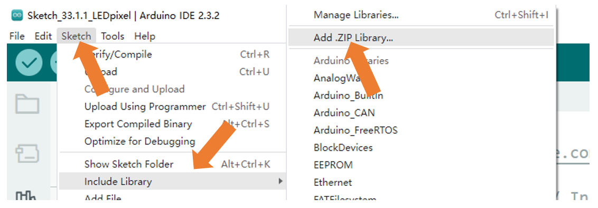